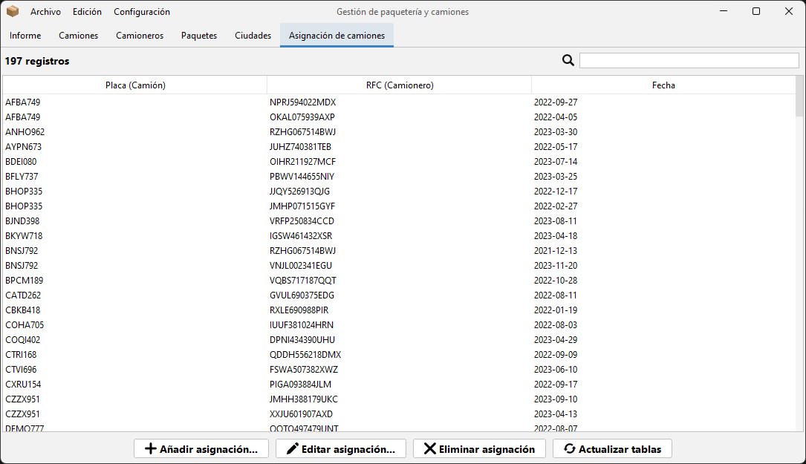
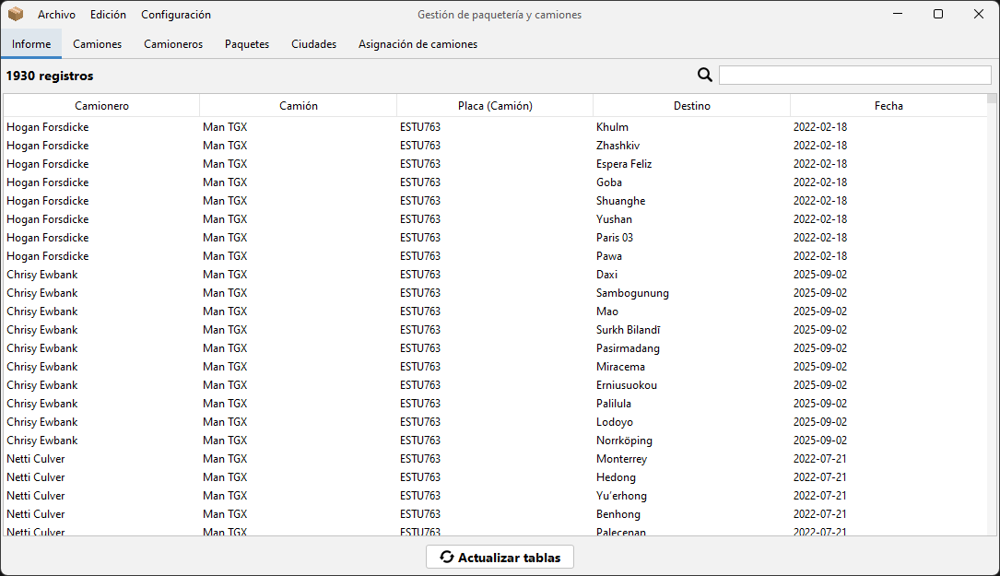
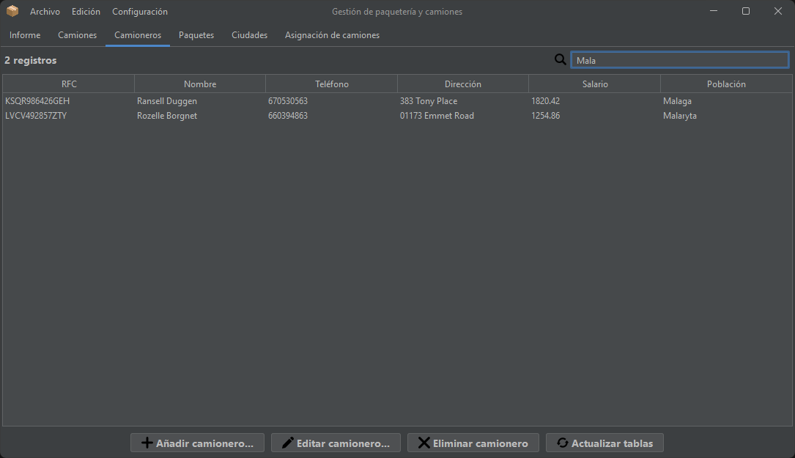
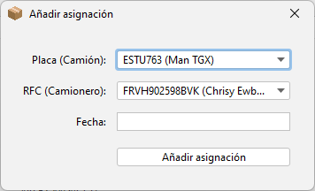
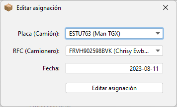
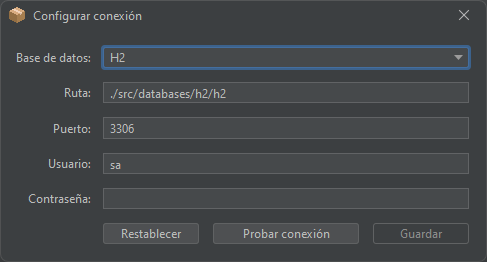

# Packages

Packages is a simple delivery database manager. It uses Java, Swing, JDBC and three different local SQL databases (SQLite, H2 and Derby).

You can switch between databases and choose light or dark mode.

> [!NOTE]  
> This app was made when I was a student and had a tight deadline, so don't expect quality code. 

# Images

